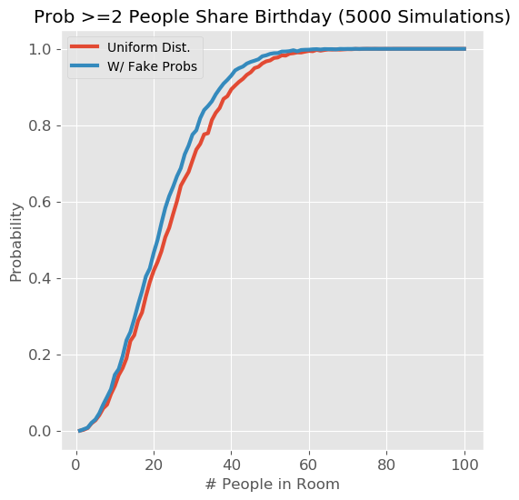

# Birthday-Puzzle-Paradox
Simulation of the Birthday Puzzle Problem in Python, including real birth data.

## Introduction
The ['Birthday Puzzle'](https://en.wikipedia.org/wiki/Birthday_problem) can be stated as follows: If a room contains N people, what is the probability that at least 2 people will share the same birthday? It has been shown that (assuming all birthdays are equally likely) the probability reaches 50% with a room size of 23 people. Intuitively (at least to me), it seems surprising that the probability is so high with only 23 people; hence the 'paradox'. 

I'll first use a simulation-based approach in python to solve the traditional problem, and see how it compares to previous results. Then i'll solve the problem again using actual US birth-rate data and see if/how the results change.

## Solution Assuming Uniform Distribution of Birthdays
- Assume all birthdays are equally likely. This can be represented by a uniform distribution from 1 to 365 (ignoring leap years). We can sample from this distribution in python using *numpy.random.randint*.
- For a given number of people in the room (*N_in_room*), draw a random sample of size *N_in_room* with replacement and check if any values occur more than once (i'll use the handy *Counter* function from the *collections* module to count the number of times each value occurs).
- Repeat this sampling process many times, then calculate the percent of times we get at least one duplicate; this is interpreted as the probability of getting at least one match for that room size.
- Repeat the above process for different *N_in_room* values, and plot the probabilities versus *N_in_room*.

The results look similar to previous solutions, with the probability reaching 50% at a room size of 23 people:

We can also easily ask other variants of the question, like "What is the probability that 3 or more people in the room share a birthday?" The probability of at least 3 people sharing a birthday reaches ~50% at a room size of 88 people:

## Solution Using Actual Probabilities of Birth Days

In the above solution, we assumed that all birthdays were equally likely; but this is not the case in real life. A friend recently shared an interesting [visualization of most common birthdays](http://www.vizwiz.com/2012/05/how-common-is-your-birthday-find-out.html), which reminded me of the Birthday Puzzle and made me wonder how the results would change if we used the actual birthday probabilities (instead of assuming a uniform distribution). 

The approach to solving the problem is the same as before, _except_ we assign a probability based on birth data to each day, instead of assuming a uniform distribution. I used [data on US births from 2000-2014 compiled by FiveThirtyEight](https://github.com/fivethirtyeight/data/tree/master/births), which I learned of from this [blog post](http://thedailyviz.com/2016/09/17/how-common-is-your-birthday-dailyviz/). 

First I summed births by month and day and visualized the results with a heatmap, producing a plot similar to those in the two blog posts mentioned above. The main takeaways are:
- There is a seasonal pattern: there tend to be more births in September +/- a month. You can do the math and see what that infers about when babies are _conceived_.
- There tend to be many less births on or close to major holidays (Thanksgiving, Christmas, New Year's, July 4th). I'm not sure if this is more due to people not wanting to give birth on holidays, or doctors not wanting to work/not available on holidays. But I thought it was interesting that it implies that in a large percentage of pregnancies, there is some leeway/choice (at least a day or two) of when exactly to give birth.

Next, to calculate the probability of being born for each day I:

- Kept only data from non-leap years
- Turned dates into yeardays (1-365) and summed births over each yearday
- Divided those values by the total number of births over all days to calculate probabilities, which sum to 1. 

These probabilities are shown in the following figure, as well as the uniform probability (1/365) indicated by the horizontal line. Although the true probabilities are definitely not uniform, the difference in magnitude isn't that large.

Intuitively, I expected that using the actual probabilities would increase the probability. However, running the simulation again using the actual probabilities, I found that the results really weren't affected significantly. 

To test whether my intuition (and/or code) was correct, I created a fake probability distribution with a similar but more drastic seasonal peak and ran the simulations again. This time the curve is indeed shifted to the left, meaning the probability of 2 people sharing a birthday for a given room size is increased (though still not by that much).

