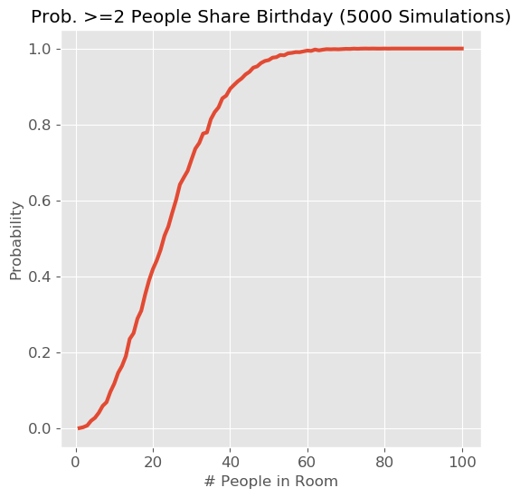
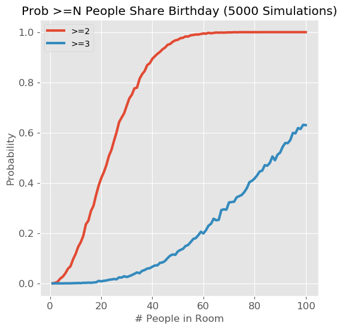
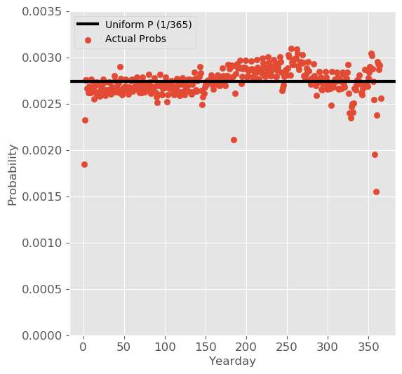

# Birthday-Puzzle-Paradox
Simulation of the Birthday Puzzle Problem in Python, including real birth data.

## Introduction
The ['Birthday Puzzle'](https://en.wikipedia.org/wiki/Birthday_problem) can be stated as follows: If a room contains N people, what is the probability that at least 2 people will share the same birthday? It has been shown that (assuming all birthdays are equally likely) the probability reaches 50% with a room size of 23 people. Intuitively (at least to me), it seems surprising that the probability is so high with only 23 people; hence the 'paradox'. 

I'll first use a simulation-based approach in python to solve the traditional problem, and see how it compares to previous results. Then i'll solve the problem again using actual US birth-rate data and see if/how the results change.

## Solution Assuming Uniform Distribution of Birthdays
- Assume all birthdays are equally likely. This can be represented by a uniform distribution from 1 to 365 (ignoring leap years). We can sample from this distribution in python using *numpy.random.randint*.
- For a given number of people in the room (*N_in_room*), draw a random sample of size *N_in_room* with replacement and check if any values occur more than once (i'll use the handy *Counter* function from the *collections* module to count the number of times each value occurs).
- Repeat this sampling process many times, then calculate the percent of times we get at least one duplicate; this is interpreted as the probability of getting at least one match for that room size.
- Repeat the above process for different *N_in_room* values, and plot the probabilities versus *N_in_room*.

## Solution Using Actual Probabilities of Birth Days

In the above solution, we assumed that all birthdays were equally likely; but this is not the case in real life. A friend recently shared an interesting [visualization of birthdays](http://www.vizwiz.com/2012/05/how-common-is-your-birthday-find-out.html), which reminded me of the Birthday Puzzle and made me wonder how the results would change if we used the actual birthday probabilities (instead of assuming a uniform distribution). 

The approach to solving the problem is the same as before, _except_ we assign a probability based on birth data to each day, instead of assuming a uniform distribution.

- http://thedailyviz.com/2016/09/17/how-common-is-your-birthday-dailyviz/
- https://github.com/fivethirtyeight/data/tree/master/births

*Caption*

*Caption*